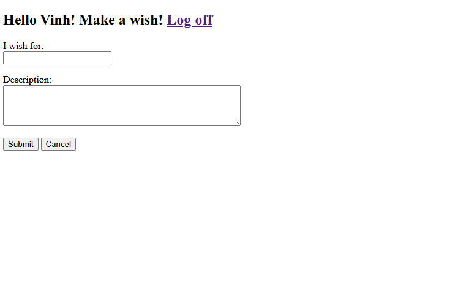
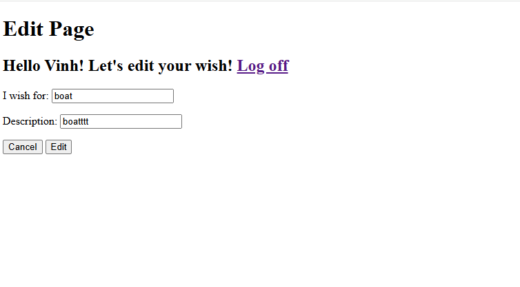

## Wishenv 
:cd in Wish_project
:python manage.py runserver

## Register and Login

## Will take you to the next page(dashboard)

## Click Make a Wish

-it will take you back to the dashboard

## Click remove
--it will remove the wish

## Click Edit of the Pending Wishes

## Click Granted! 
--the bottom of the table: Granted Wished will populate

