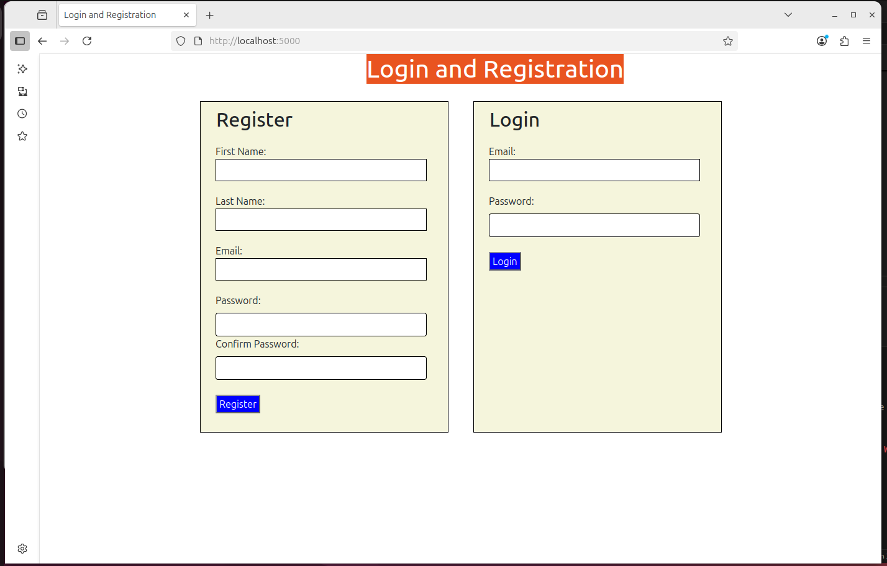

## Run recipe  in Linux
:python3 -m venv venv
:source venv/bin/activate
:pip install pipenv
:pipenv install
:pipenv shell

## Open Terminator Terminal and install MySQL  and run server
:sudo apt update
:sudo apt install mysql-server
:sudo service mysql start
:sudo service mysql status
:sudo mysql -u root -p (while inside the mysql> )
mysql>SHOW DATABASES; (see if database recipes is there, not create it)
:CREATE DATABASE recipes; ( so can connect to database)
:exit (mysql)

:pip install flask flask-bcrypt pymysql
:pip install flask flask-bcrypt pymysql flask-wtf
:pip freeze > requirements.txt
:python server.py
:Open browser -http://localhost:5000/  ( doesn't work)
:sudo mysql
:CREATE USER 'flaskuser'@'localhost' IDENTIFIED BY 'password123';
GRANT ALL PRIVILEGES ON recipes.* TO 'flaskuser'@'localhost';
FLUSH PRIVILEGES;
EXIT;

## Login to Dasboard

## Create requirements.txt
pip freeze > requirements.txt

##### ##Create a Dockerfile in recipe folder

:touch Dockerfile
# Use official Python slim base image

FROM python:3.12-slim

# Set working directory inside the container
WORKDIR /app

# Copy project files into the container
COPY . /app

# Install dependencies
RUN pip install --upgrade pip && \
    pip install -r requirements.txt

# Expose the port Flask will run on
EXPOSE 5000

# Define the command to run the app
CMD ["python", "server.py"]

## Build Docker image in recipe project
docker build -t recipe-app .

## Run the app
docker run -p 5000:5000 recipe-app

## Create docker-compose.yml  --- in recipe project
:touch docker-compose.yml
version: '3.8'

services:
  mysql:
    image: mysql:8.0
    container_name: mysql-db
    restart: always
    environment:
      MYSQL_ROOT_PASSWORD: root
      MYSQL_DATABASE: recipes
    ports:
      - "3306:3306"
    volumes:
      - mysql_data:/var/lib/mysql

  web:
    build: .
    container_name: recipe-app
    ports:
      - "5000:5000"
    depends_on:
      - mysql
    environment:
      - FLASK_ENV=development

volumes:
  mysql_data:

## Start mysql-db
docker start mysql-db
docker exec -it mysql-db mysql -uroot -proot recipes

## Update your database connection config (e.g., in mysqlconnection.py) to:
change it to 'mysql'
:connection = pymysql.connect(host='mysql',

## Run the application stack (build + start both containers):
docker-compose up --build
open browser

## Set Up NGINX as a Reverse Proxy (inside Docker)
--In recipe directory
:nano nginx.conf
events { }

http {
    server {
        listen 80;
        server_name localhost;

        location / {
            proxy_pass http://web:5000;
            proxy_set_header Host $host;
            proxy_set_header X-Real-IP $remote_addr;
        }
    }
}

## Add to docker-compose.yml
nginx:
    image: nginx:latest
    container_name: nginx-recipe
    depends_on:
      - web
    ports:
      - "80:80"
    volumes:
      - ./nginx.conf:/etc/nginx/nginx.conf:ro

---above the volumes:
                mysql_data:

## Kubernetes  -----------------
:mkdir k8s
:cd k8s
create 4 yaml manifests
-mysql-deployment.yaml
-flask-deployment.yaml
-nginx-deployment.yaml
-k8s-secret-configmap.yaml (optional, for secrets/configs)

:kubectl apply -f k8s/ (deploy all)

## Minikube--------------
:minikube start
:eval $(minikube docker-env)
:docker build -t recipe-app:latest .
:minikube status
:kubectl apply -f k8s/

## Verify Your Deployments
:kubectl get pods
:kubectl get deployments
:kubectl get services

:minikube service nginx-service
:minikube dashboard